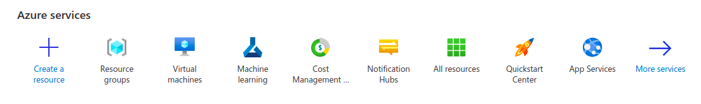

# Setup

As you might expect, the first step to getting started with any new technology is setting up a couple of tools.

We'll be using [github.dev](github.dev), a free, online code editor, for this workshop. If you've ever used [Visual Studio Code](code.visualstudio.com), this code editor may look familiar to you.

Another tool in our kit is going to be Azure. if you do not have an Azure account, please do [create one](https://azure.microsoft.com/en-in/free/).

## Creating a repository and opening it in github.dev

Let's start by creating a new repository for this project on GitHub, and then opening it in github.dev.

1. If you don't have a GitHub account, go ahead and [join GitHub](https://github.com/join). Then, [create a new public repository](https://github.com/new) named **predicting-harvest-time**. If you've never made a GitHub repository before, check out the [documentation](https://docs.github.com/get-started/quickstart/create-a-repo) for more information. Make sure to select **Public** and to initialize the repository with a **README**.
1. Navigate to your new repository on GitHub.
1. Open the repository in github.dev by pressing the `.` key from the repository page, or swap `.com` with `.dev` in the URL. This will set up a [VS Code](code.visualstudio.com) environment in your browser.

## Create a resource group in Azure

Once you have logged into [Azure](https://portal.azure.com) you can follow the following steps to create a resource group.

1. Click on the **Resouce groups** icon under Azure services as seen from the image above.

2. In the **Search Extensions** text box in the upper-right corner, type **CodeSwing**
3. Select **Install** for **CodeSwing**

The extension will be installed.

## Turn on AutoSave

One of the best productivity features in github.dev and Visual Studio Code is **AutoSave**. AutoSave automatically saves changes to your files, so you don't have to worry about losing any of your work. To turn on AutoSave, select the three parallel lines icon on the left-hand side of your github.dev window in the Activity Bar. Go to **File > AutoSave**. Your AutoSave is turned on if there is a check mark next to the AutoSave menu item.

## Summary and next step

Congratulations! You have the tools you need to begin creating HTML and CSS pages. Next, let's [create our first page](./1-create-html.md).
