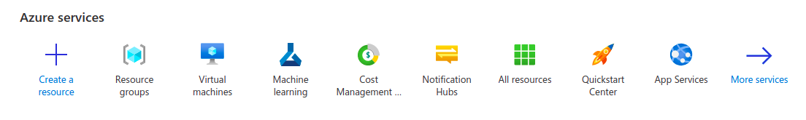
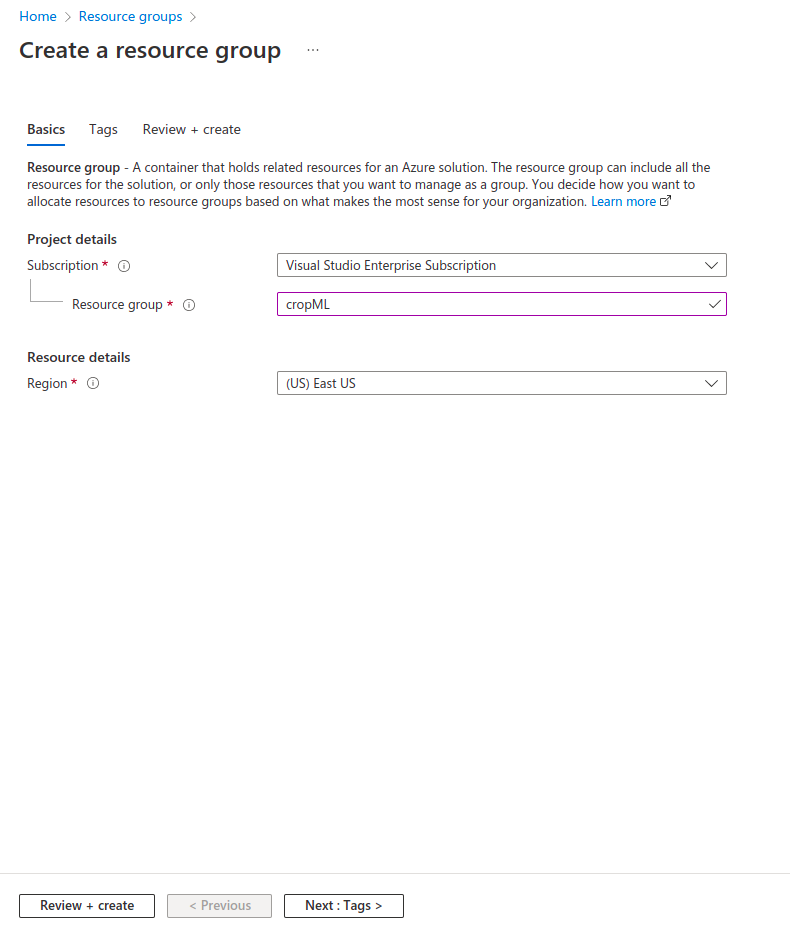
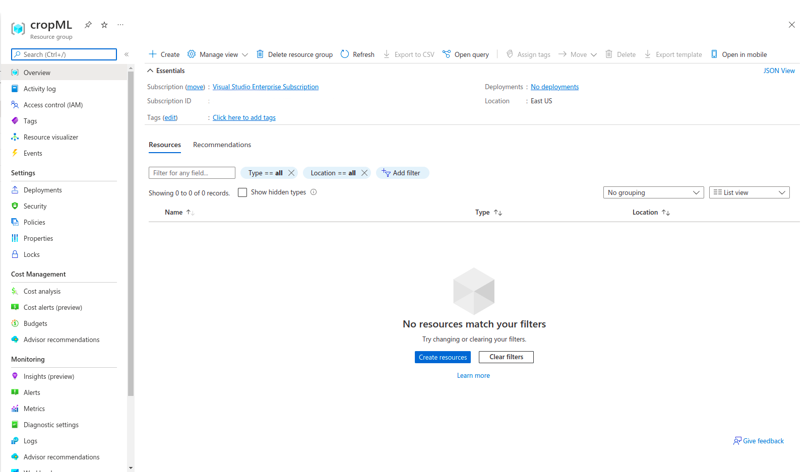

# Provisioning the necessary resources on Azure

The Azure cloud platform is more than 200 products and cloud services designed to help you bring new solutions to life—to solve today’s challenges and create the future. Build, run and manage applications across multiple clouds, on-premises and at the edge, with the tools and frameworks of your choice.

## Create a resource group in Azure

Once you have logged into [Azure](https://portal.azure.com) you can follow the following steps to create a resource group.

1. Click on the **Resouce groups** icon under Azure services as seen from the image above.

2. Click on the **Create** button in the upper-left corner.

3. Fill in **cropML** as the name of the Resource group and choose and appropriate region. Click on the **Review + create** button in the bottom-left corner.

4. Click on the **Create** button after reviewing the details.

The resource group will be created.

## Provisioning resources

1. Navigate to the **cropML** resource group page. It should look something like the image given below.

2. Click on the **Create resources** button.

3. Search for **IoT Hub** by **Microsoft**. Give it a name of **cropIOT** and fill in the other details and create it.

4. Next, search for **Azure Machine Learning** by **Microsoft**. Give it a name of **cropWorkspace** and fill in the other details and create it.

5. Lastly, search for **Storage Account** by **Microsoft**. Give it a name of **cropstorage** and fill in the other details and create it.

Now that all the resources have been provisioned, we can move onto [connecting IoT devices to the hub.](./2-add-and-connect-IoT-devices.md)