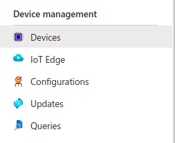
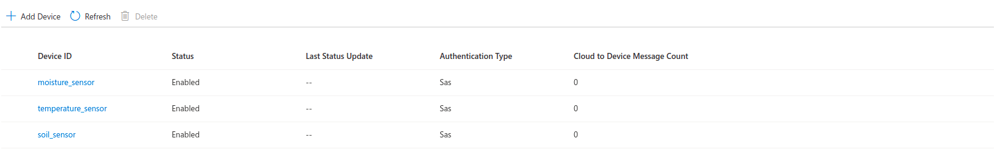
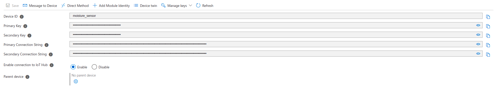

# Add and connect IoT devices

The Azure Internet of Things (IoT) is a collection of Microsoft-managed cloud services that connect, monitor, and control billions of IoT assets. In simpler terms, an IoT solution is made up of one or more IoT devices that communicate with one or more back-end services hosted in the cloud.

## Adding devices to IoT hub

1. Choose **Devices** under the **Device management** section in your IoT hub as shown below.

2. Click on the **Add Device** button in the **devices** tab.

3. Create 3 devices namely: **moisture_sensor**, **temperature_sensor** and **soil_sensor**.

4. Click on each sensor and copy the **Primary Connection String** as shown below.

Now that the connection strings have been stored, we can move onto [sending data from IoT devices.](./3-send-data-from-IoT-devies.md)