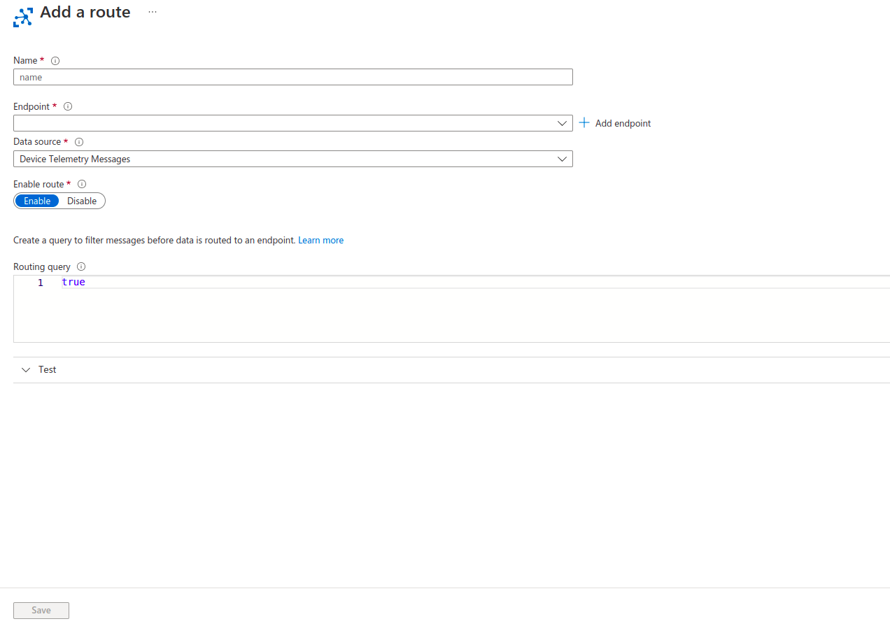

# Extract data from IoT hub

Message routing enables you to send messages from your devices to cloud services in an automated, scalable, and reliable manner. Message routing can be used for:

- **Sending device telemetry messages as well as events** namely, device lifecycle events, device twin change events, digital twin change events, and device connection state events to the built-in-endpoint and custom endpoints.

- **Filtering data before routing it to various endpoints** by applying rich queries. Message routing allows you to query on the message properties and message body as well as device twin tags and device twin properties.

## Creating a custom endpoint

1. To begin with, choose the **Message routing** tab under the **Hub settings** section.

2. Click on the **Custom endpoints** tab and choose **Add** in the page shown below. Choose **Storage** from the drop down menu.

3. Name your endpoint **crop-sensor-endpoint** and ensure that the **Encoding** setting is set to *JSON* along with the **File name format** set to `{iothub}/{YYYY}/{MM}/{DD}/{HH}/{mm}/{partition}` as shown below.

4. Select the Azure Blob storage account provisioned in [step-1](./1-provision-resources-in-azure.md). Create a new container in it called **data** and select it as the destination for the telemetry messages.

5. Click on the **Create** button in the bottom-left corner of your screen.

## Add a route

1. To begin with, choose the **Message routing** tab under the **Hub settings** section.

2. Click on the **routes** tab and choose **Add**. You will be taken to page as shown below.

3. Name your route **crop-sensor-route** and ensure that endpoint is selected as **crop-sensor-endpoint**.

4. Click on **Save**.

5. You can now run the sensor code and view the data stored.

Now that we have set a destination for our data, we can move onto [creating a model](./5-create-a-model.md)