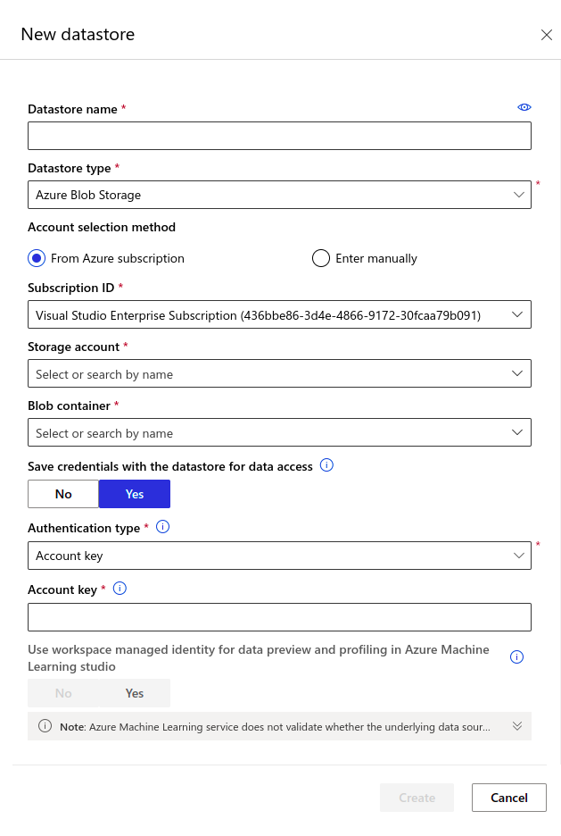
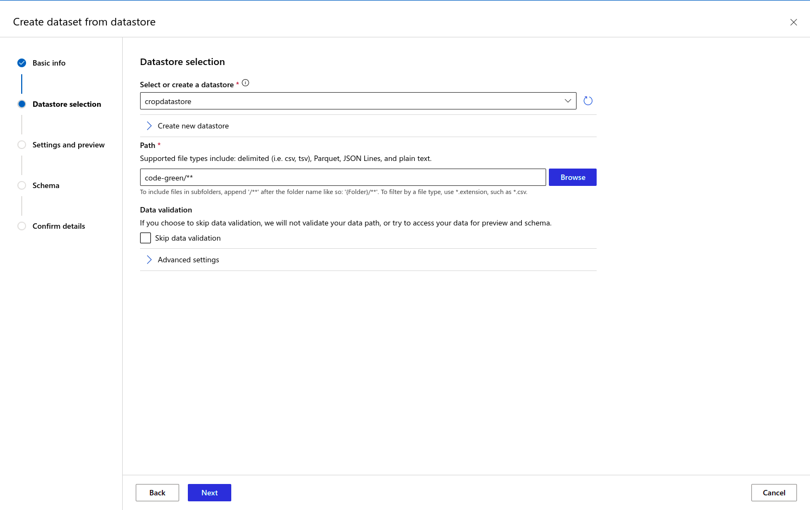
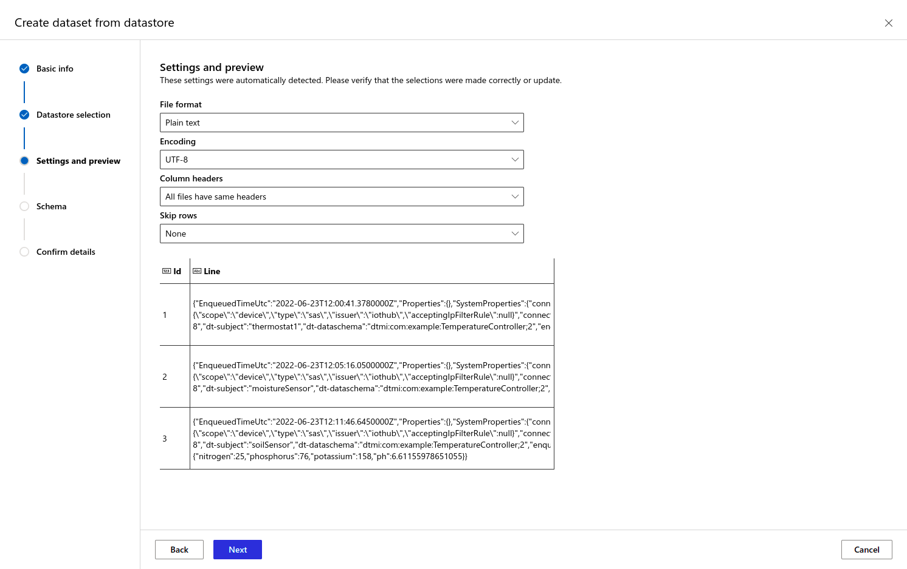

# Develop a model and make a prediction

Azure Machine Learning is a cloud service for accelerating and managing the machine learning project lifecycle. Machine learning professionals, data scientists, and engineers can use it in their day-to-day workflows: Train and deploy models, and manage MLOps.

You can create a model in Azure Machine Learning or use a model built from an open-source platform, such as Pytorch, TensorFlow, or scikit-learn. MLOps tools help you monitor, retrain, and redeploy models.

## Overview of the model

1. The code to train the model and make predictions can be found [here](./code/models/crop.ipynb).

2. The model uses [Multi Linear Regression](https://www.investopedia.com/terms/m/mlr.asp#:~:text=Key%20Takeaways-,Multiple%20linear%20regression%20(MLR)%2C%20also%20known%20simply%20as%20multiple,uses%20just%20one%20explanatory%20variable.) to predict time for harvest in days.

3. The training dataset can be found [here.](./code/models/crop-data.csv)

## Setting up Azure ML Workspace

1. Go to your Azure Machine Learning Workspace and launch the ML studio.

2. Upload the **crop.ipynb** file and **crop-data.csv** file to the studio. You will have access to a web editor and a terminal through which you can edit code or install packages using [pip](https://pypi.org/project/pip/).

3. Create a new Datastore by navigating to the **Datastores** tab under **Manage** section. Give it a name of **cropdatastore** and choose the storage account provisioned in [step 1](./1-provision-resources-in-azure.md). Choose the container by the name of **data**. If it does not exist, then create it.

4. Copy the account key from the **Access keys** tab in your storage account. Paste it in the required place. Click on **Create**.

5. Create a dataset by navigating to **Data** tab under **Assets** section. Click on the **Create** button in the top-right corner and choose **From Datastore** from the drop down menu. Give it a name of **crop-asset** and click **Next**.

6. Select **cropdatastore** from the drop down menu and provide the file path shown in the following picture. Click on **Next**.

7. Ensure that the settings are set to the values as shown below.

8. Click **Next** twice and then click **Create**.

9. Click on **crop-asset** from the datasets list and navigate to the **Consume** tab.

10. Copy the code and insert it under the **Predicting optimum harvest time** section in **crop.ipynb**.

11. Ensure that the `Dataset.get_by_name` function gets right dataset passed as variable.

12. Clear the existing JSON files from blob storage and the codes for all 3 sensors.

13. Following the above step, you can run **crop.ipynb** to get a prediction.